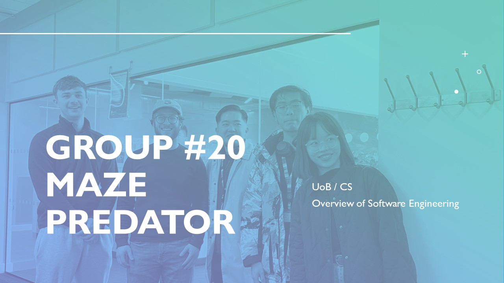

# Group #20

## Game Demo

# 1. Team

## 👀 Who are we?

## Here is the list of members**:**

| Name | Github Link |
| --- | --- |
| Flora Cheng | https://github.com/floracheng292 |
| Zhixiang Li | https://github.com/lizhixiang1 |
| Joseph James | https://github.com/josephjames1 |
| Adam sommers | https://github.com/adam-sommers |
| Yuan Quan | https://github.com/WayfarerYuan |

  
---  
    
# 2. Introduction

We created a maze game with unique features that distinguish it from other maze games. In our game, the player not only tries to find the exit to the maze but must also evade multiple enemies navigating the maze. Additionally, we developed a dynamic maze that allows users to manipulate it directly using power-ups.

We encountered several challenges during the development process. The first challenge was to randomly generate game levels at multiple difficulty levels to make the game replayable, with varying difficulty levels to appeal to a broader audience. The second challenge was coding the behavior of the enemies in the maze. The third challenge was to create a game board that can be directly changed by the user, which adds a fun interactive component to the game.

---

# 3. Requirements
- ## 3.1 Early Stage Design
    
<Strong>Originally, we proposed a number of different ideas of which game should be chosen. The game genres that we proposed are as follows:</Strong>

    1. Space Invadors:

        [https://www.andoverpatio.co.uk/21/space-invaders/](https://www.andoverpatio.co.uk/21/space-invaders/)
    
    2. Airplane/Tanker War
    3. Mario (2D scroller)
    4. Maze:
 
        [Free Maze Games for Kids by HappyClicks](https://www.happyclicks.net/maze-games/index.php)
    
        [https://www.mysteinbach.ca/game-zone/1507/maze/](https://www.mysteinbach.ca/game-zone/1507/maze/)
    
    5. Snake (Maybe twist is to add an AI snake to compete)
    6. Cat Mario:

        [Cat Mario online](https://www.cat-mario.com/)
    
    7. Plant VS Zombie
    8. Pacman

    
<strong>We finally choose the maze game for the following two reasons:</strong>

    1. First, this is our first time collaborating as a team to develop a game. In order to ensure that we can complete all development tasks within the            specified time frame and experience every stage of development, we chose the relatively less difficult maze game.
    2. Second, we all have some unique ideas for this maze game, which ensures its originality.

- ## 3.2 Ideation Process
    
Initially, our group held a brainstorming meeting to discuss the specific content of the game project. Discussion topics included setting the content of the main menu, the game process, and game ending options. Each member of the group took turns to speak and present their ideas. In cases of disagreement, we discussed to determine the final choice.

    
Regarding the setting of the main menu, we believed it should include the option to choose a game character (any of three different animals) and the difficulty level (three different levels). The purpose of choosing a game character is to provide a different visual experience, without granting different game characters different skills. The purpose of choosing a difficulty level is to cater to different groups of players, from those who prefer an easier mode to those who enjoy a more challenging game.

    
The gameplay is very simple. First, the player can use the four arrow keys on the keyboard to control the character to move freely in four different directions. Second, the player must avoid predators that may appear on the path leading to the end. Third, the player must pick up keys that fall on the path, which can be used to turn one square of the fence that separates the maze into a path.

    
After the game ends, the player can choose to exit the game, restart the game with the same settings, or return to the main menu to choose a different game character and difficulty level before starting again.

- ### 3.2.1 Game design demo:
 
    

- ## 3.3 User case diagram
    
    
- ## 3.4 User Stories
    1. As a player, I want to be able to select an animal character so that I can have different visual experience.
    2. As a player, I want to be able to select a different difficult level so that I can play with a mode suits my age.
    3. As a player, I want to exit the game anytime I wanna do it so that I can leave the game freely.
    4. As a player, I want to go through four different directions so that I can get to the destination.
    5. As a player, I want to restart the game during the game so that I can not struggle with some extremely stricky game map.
    6. As a player, I want to pick up a key so that I can use it later to alter an obstacle to a path.
    7. As a player, I want to  play again with the same character and the same difficult level when the game is over so that I can continously killing my boring time.
    8. As a player, I want to go back to main menu so when the game is over so that I can chose a new character and a new difficult level. 
    9. As a game player, I want to return to the previous menu when I setting the game so that I can modify the setting that I wrongly set.
 
# 4. Design
 
Overall, in terms of design, our game is divided into three parts according to the game progression.

The first part is the main menu after the player enters the interface. According to the player's preferences, different animals and game difficulty can be selected. After confirming the selection, you will enter the game.

The second part is the main part of the game. First, we created the mazeGenerator class. The main purpose of this class is to randomly generate a corresponding two-dimensional board to form a maze according to the difficulty of the game selected by the player. The Character class represents the animal selected by the player. The animal can move freely in the maze but be careful not to be caught by ghosts. The purpose of the game is to let the player find the exit. At the same time, there is also a ghost class that will move the maze randomly. You never know which direction the ghost will move next time. It may be waiting for you at the exit or entrance! There will probably be 1-5 ghosts in the maze. In order to increase the fun of the game, we designed the key class. The main purpose of this class is that animals can find the key on the map. After having the key, they can pass through the walls, and players can avoid ghosts in time and find the exit faster. Game start, failure and end are recorded by the gameState class. The game determines the interface after the game is over according to the state of gameState.

After the game is over, the player can freely choose to play another round or return to the main menu to reproduce the selection of animals and difficulty.

Below are the class diagram and sequence diagram about game design.

- ## 4.1 Class diagram

- ### 4.1.1 Class function
**BetaMazeGenerator**: The main function of this class is to use DFS to generate a maze. The specific mechanism is to start from the starting point and mark it as visited. Repeat the following until all cells are visited:
- Find unvisited adjacent cells of the current cell.
- If there is an unvisited neighbor, remove the wall between them, mark it as visited, and move to that cell.
- If there are no unvisited neighbors, backtrack to the previous cell.

**Cell**: This class is like a container, which is reflected in the game as small squares in the maze. Each cell can be a road, wall, animal, key and chaser. We use the cell class to build a two-dimensional game board.

**GameState**: The function of this class is to record the state of the game at all times. This class is activated when the game starts. When the game is won or lost, it will record the corresponding winning or losing status and record the end of the game. Through this class, we can design different game interaction interfaces through the state of the gamestate during the development process to give players a better gaming experience.

**Character**: This class represents the player, which can be a rabbit, mouse or tiger according to the player's choice. This class defines that the player can move freely in the maze, but can only walk on the road without obstacles, and cannot pass through the walls.

**Ghost**: This class represents the hunter. This class defines that the hunter can also move freely in the maze, and move randomly. At the same time, he can only walk on the road without obstacles and cannot pass through the wall. According to the difficulty chosen by the player, the number and speed of the hunters in the maze will gradually increase.

**Key**: The main function of this class is to allow the player to pass through the wall, but it is a one-time use. A key in the maze represents an ax that can only pass through one wall.

- ## 4.2 Sequence diagram

---

# 5. Implementaion

The implementation of the game  is divided into three main sections: the main menu, the game itself, and the level generator. When developing the game, we faced three main challenges: randomly generating the levels, coding the behavior of the enemies, and making the environment dynamic and interactive.

In the main menu, the user selects their character and difficulty level. They can choose from a tiger, rabbit, or rat  for their character and easy, medium, or hard difficulty. The UI is made more visually appealing with several image files, including a background image and images for the characters. The code tracks the state of whether an animal and difficulty level have been selected, and the game can only be started once both are selected. Methods update this state when the user selects their animal or difficulty level. An mp3 file is also played on the menu to make it more entertaining.

The level generator generates a level based on the user's selected difficulty. Easy levels are a 11x11 grid, medium is a 21x21 grid, and hard is a 31x31 grid. The implementation uses a modified depth-first search (DFS) algorithm to generate the maze. The maze is represented as a 2D boolean array, where true values represent traversable cells and false values represent walls. The generateMaze method takes the starting position of the maze as input, sets that cell to be traversable, initializes a random number generator, and calls the DFS method with the starting position and random number generator. The DFS method takes a current position and a random number generator as input, randomly determines the next direction to move in, checks whether the cell in that direction is a valid and unvisited cell, and sets the cell to be traversable if it is. The algorithm then recursively calls the DFS method with the new position and random number generator. If the cell is not valid, the algorithm tries the next direction in the shuffled list until it finds a valid direction or exhausts all possibilities. The implementation also includes methods to check whether a given coordinate is valid and get the position of the maze exit.

After selecting the game options and loading the level, the game can begin. The program loads the images used to style the game board, initializes the grid, player's character, and enemies. The grid is a 2D array of cell objects that represents the maze. The animal and enemies are instances of the character and enemy classes, respectively. The animal's movement is controlled by the user, who can move into open spaces but is blocked by closed spaces. The user can modify the structure of the maze using power-ups. The game includes four power-ups scattered throughout the maze. When consumed, they allow the player to break through walls to evade enemies and safely reach the exit. The program checks the number of power-ups when the user tries to move into the location of a wall. If the number of power-ups is greater than zero, the wall transforms into an open space. The enemies' movement works by determining available spaces they can move to (they are also blocked by walls). Once this is determined, the enemy randomly selects one of these spaces to move into. Enemies cannot pick up power-ups or break through walls.

The program features a draw() function that displays the maze, animal, enemies, and power-ups, and checks for collision detection between the animal and enemies. If the animal collides with an enemy, the game is lost, and the displayGameLost() function is called to give the user a message and the option to restart or go back to the main menu. If the animal reaches the exit, the game is won, and the displayGameWon() function is called to display congratulations and the option to play again or go to the main menu. The game also features a menu bar that gives the user an option to pause, restart, or go to the main menu, and also informs the user how many power-ups they currently have. The pause button stops the game and brings up a pause screen that gives the user options to resume or go to the main menu. The restart button restarts the game with the same animal and difficulty level selected, while the main menu button takes the user back to the main menu.

Overall, the implementation of the game involves the main menu, the level generator, and the game itself, with each section presenting its own unique challenges. The randomly generated maze and the behavior of the enemies add a level of difficulty to the game, while the power-ups and dynamic environment make it more engaging for the user. The menu bar provides a convenient way for the user to pause or restart the game, and also displays the number of power-ups the user has.

---

# 6. Evaluation

## 6.1 Qualitative Evaluation:

In our game development and sprint cycles, we prioritise the user-centred development process, with particular emphasis on Human Computer Interface (HCI) design. This approach is crucial to ensure that our software meets user requirements and that our software development process is efficient and agile, ultimately reducing costs and improving usability in the real world.

To select the most practical qualitative evaluation method, we conducted both a Think Aloud assessment and a Heuristic Evaluation. We compared their benefits and the scope of results, to then focus on one qualitative evaluation methodology to use during code iterations. This was made possible due to the ease of collation in HCI methods and the instant gratifications of results. Please find the results below, this was made on our first fully functional prototype:

 

Both sets of results provide insight into the user experience of using our software, and we are able to determine the major issues with our programme as a result. However, the key difference between the two is that Heuristic evaluation is an analytical method based on a set of researched and proven principles whereas the Think Aloud assessment is an empirical technique where results are more subjective and could be influenced by social desirability. We therefore chose the Heuristic evaluation technique as our qualitative HCI method for the following code iteration.

The results on the first iteration for the Heuristic evaluation show that the game functionality was the main issue and wasn’t up to the experts expectations with a lack of ‘User control and freedom’ as well as little to no ‘Aesthetic and minimalistic design.’ We therefore made it a priority to get a fully functioning game with an appealing GUI aesthetic for the following iteration.

After the second iteration and Heuristic evaluation, our results from the expert dramatically improved, severity scores on software issues decreased drastically, while previously mentioned functionality issues did not arise, for example, “When you get to the end of the game it does not say you have won – no winning functionality available yet.” 

Our code following further iterations now caters for the issues highlighted in the Heuristic evaluations.

## 6.2 Quantitative Evaluation:

Our quantitative evaluation method of choice was a NASA TLX, this is because we wanted to assess the perceived workload of two difficulties in the game. We then used statistical testing through the Wilcoxon Signed Rank Test to be able to determine if it was statistically significant as an increase in difficulty through workload of the user.

Here are the NASA TLX tables for both easy and difficult difficulties:

These results give a W test statistic of 0 while N = 10. This is statistically significant at the 0.5% interval, and shows there is an statistically significant increase in perceived workload for the easy game vs the difficult one. This is what we wanted to achieve as a team to be able to cater for a variety of individuals and still maintain engagement.

## 6.3 Testing:

When we tested the code, we utilized a black box testing method called Equivalence Partitioning (EP). This method involves dividing testing into functional units and then into value categories. To ensure that all functional areas of the game were tested with strong code, we developed a 'check-list' for each functional unit. To identify the different categories, we involved all team members in the process to ensure that all functional areas were covered.

Additional features such as sound were introduced at a later stage of the software development process. Once these functions were integrated, the team repeated the testing process, which led to a smooth and bug-free game.

---

# 7. Process

For this maze game project, our team used a combination of online discussions and live meetings to collaborate effectively. We used GitHub to sync and merge our work and clearly defined individual roles on the team. What follows is a look at each of the following perspectives: how we collaborated, the tools we used, our team roles, and our reflections on this collaboration.

## 7.1 How we developed the game:

Throughout the development of the game project, we used the agile development approach to adapt to changes in goals and make timely adjustment basing on our user feedbacks. This flexible approach allowed our team to adapt to changing requirements and ensure that our game continued to meet the desired vision and user expectations. By breaking the development process into smaller, manageable iterations, we found our way to effectively prioritize tasks, make improvements, and deliver a better final product.

In addition to agile development, our team members utilized a "Kanban-like" tool to help better organize and schedule our game development process. These tools provide a visual representation of our workflow, allowing us to monitor what is currently in progress, and manage tasks more effectively. Here is a example screenshot of our Kanban:

## 7.2 Collaborative approach:

Our team used a hybrid approach to collaboration, including online discussions and offline meetings. We have organized several face-to-face meetings, during which we decided on the game's topic, break down the project and assigned tasks, and worked together to discuss about and resolve major bugs we met.

In addition to the meetings, GitHub was our main tool for synchronizing and sharing our work. It helps us to maintain separate branches for each team member's code contributions. We also created a "public" Dev branch where we merge the individual branches and that allows us to review, test, and debug the latest version of the game with the new added features. Whenever a team member completes a feature of the game, they submit a pull request for review and possible integration into the public development branch. The final approved version of the game is kept in the "main" branch which represents for the ‘product’ version. Here is a part of out Git operations:

## 7.3 Team Roles and Contributions:

Our team was characterized by a clear distribution of roles, allowing each member to focus on their area of expertise. Here is our “Dev stories”:

- As the lead game architect, Adam needed to design the fundamental structure of our game. He successfully laid the foundation upon which other team members built their code.
- As the creative game designer, Flora was tasked with adding unique elements to differentiate our game from typical maze games. She effectively designed the "predator" role, introducing excitement and challenge to the gameplay.
- As the maze developer, Yuan was responsible for creating the maze itself. He skillfully implemented a random algorithm, ensuring that the game presented a fresh experience each time it was played.
- As the user interface designer, Zhixiang focused on crafting a visually appealing and intuitive interface. He accomplished this by designing and implementing menus within our game pages.
- As the user experience specialist, Joseph was responsible for optimizing the game's usability and enjoyment. He diligently created documentation and organized real-life user tests, using the valuable feedback gathered to inform further adjustments and improvements to our game.

## 7.4 Reflection on Teamwork Experience:

Our team's collaboration was a positive and enriching experience, primarily due to the clear understanding of individual roles and responsibilities. Each member knew what they were expected to contribute, leading to a seamless development process and a strong sense of unity within the group. The combination of online and offline collaboration methods, as well as the effective use of GitHub, further facilitated our teamwork.

In conclusion, our game development project exemplified the power of teamwork, with each member playing a crucial role in the final product. Our hybrid approach to collaboration, along with the use of GitHub and well-defined roles, contributed to the success of our project. As a team, we look forward to applying the lessons learned from this experience to future collaborative endeavours.

---

# 8. Conclusion

As a team, we worked collaboratively to choose a game and determine what users would want from it. This involved brainstorming and discussing ideas to identify potential games that would be popular among users. Once we had chosen a game, we began to gather information about what users would want from it. This process involved user stories, which helped us understand what features and functions were important to users. By understanding what users wanted, we were able to design a game that met their needs.

To create the game, we used an iterative, agile development process. This meant that we broke the project down into small, manageable chunks and worked on each piece one at a time. We used feedback from each iteration to inform our decisions and make changes as needed. This approach allowed us to create a game that was well-suited to users' needs, while also being efficient and effective in its development.

Throughout the game ideation process, we brainstormed through multiple sprints to come up with the characters, difficulty levels, and maze-like gameplay. This involved gathering input from the whole team to ensure that each aspect of the game was carefully considered. By working collaboratively, we were able to create a game that was well-rounded and enjoyable for users.

We encountered various challenges in creating the game, including the auto-generation of board sizes and implementing power-ups to allow for user playability. These challenges were overcome through teamwork, with each team member contributing their expertise and knowledge to find solutions. Other challenges, such as creating an adaptable board structure, were solved through research. By being resourceful and creative in our problem-solving, we were able to create a game that was both enjoyable and functional.

Our choice to use MainMenu, MenuBar, MazeGenerator, and mazeGameBasic classes demonstrated a well-thought-out approach to game design. Each class served a specific purpose, and we were able to use them effectively to create a game with pleasing visuals and intuitive gameplay.

Looking to the future, we identified several areas where the game could be improved. This included adding different board styles and structures, as well as more challenges like "side quests." We also suggested that improving the characters' abilities could increase the game's replayability and user engagement. By identifying areas for improvement, we demonstrated our commitment to creating a game that users would love.

In conclusion, our efforts as a team resulted in a well-designed game that effectively captured users' needs. By using an iterative, agile development process and working collaboratively, we were able to create a game that was both enjoyable and functional. With the addition of more levels, items, and character abilities, the game has the potential to become even more engaging. Overall, our work on the project shows great promise for future game development.

---
# 9. Table of Contribution

| Name | Contribution Value |
| --- | --- |
|  Flora Cheng|  1|
|  Zhixiang Li|  1|
|  Joseph James|  1|
|  Adam sommers|  1|
|  Yuan Quan|  1|

---

